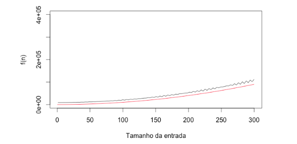
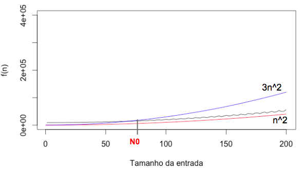

# Estrutura de dados e Algoritmos 
<blockquote>Análise assintótica</blockquote>


<p>joao.arthur@computacao.ufcg.edu.br</p>
<a style="position: fixed; bottom: 2%; font-size:18px" href="http://joaoarthurbm.github.io/eda">joaoarthurbm.github.io/eda</a>

---

# Aula escrita

Conteúdo detalhado em <a style="font-size:20px" href="https://joaoarthurbm.github.io/eda/posts/analise-assintotica/">joaoarthurbm.github.io/eda/posts/analise-assintotica/</a>.

---

# O que veremos

### Análise assintótica

- Motivação

- Por que?

- Notação assintótica
    - &theta;, O, &Omega;, &omega; e o.

---
# Análise de eficiência: método analítico

```java
	public static int search(int[] v, int k) {

		for (int i = 0; i < v.length; i++)
			if (v[i] == k)
				return i;
		
		return -1;

	}
```

--


<center>
<p style="font-size:30px">f(n) = c<sub>1</sub> * n + c<sub>2</sub></p>
</center>

---

# E se?


<p class="center" style="font-size:30px;position:fixed;bottom:50%;right:15%">f(n) = 1.1 * n<sup>2</sup> + (10 + sin(n + 15) * n<sup>1.5</sup>) + 9000</p>

---

# Um palpite

<p >1.1 * n<sup>2</sup> + (10 + sin(n + 15) * n<sup>1.5</sup>) + 9000 = <b>&theta;(n<sup>2</sup>)</b></p>

<p style="position: fixed; bottom: 2%; font-size:18px"> Por enquanto, vamos interpretar <b>&theta;</b> como "mesma ordem de crescimento." </p>

--


---

# Um palpite

<p >1.1 * n<sup>2</sup> + (10 + sin(n + 15) * n<sup>1.5</sup>) + 9000 = <b>&theta;(n<sup>2</sup>)</b></p>



<p style="position: fixed; bottom: 2%; font-size:18px"> Por enquanto, vamos interpretar <b>&theta;</b> como "mesma ordem de crescimento." </p>


---

# Um palpite

<p >1.1 * n<sup>2</sup> + (10 + sin(n + 15) * n<sup>1.5</sup>) + 9000 = <b>&theta;(n<sup>2</sup>)</b></p>


<p style="position: fixed; bottom: 2%; font-size:18px"> Por enquanto, vamos interpretar <b>&theta;</b> como "mesma ordem de crescimento." </p>

---

# Como?

<p class="center" >1.1 * n<sup>2</sup> + (10 + sin(n + 15) * n<sup>1.5</sup>) + 9000 = <b>&theta;(n<sup>2</sup>)</b></p>

<br>
<br>

<b>Ordem de crescimento:</b> a ideia é determinar como o algoritmo se comporta para valores muito grandes de entrada (n).

<b>Eficiência assintótica:</b> entradas grandes para tornar relevante apenas a ordem de crescimento do tempo de execução.
<p style="position: fixed; bottom: 2%; font-size:18px"> Por enquanto, vamos interpretar <b>&theta;</b> como "mesma ordem de crescimento." </p>

---

# Como?

<p class="center" ><del>1.1</del> * n<sup>2</sup> + <del>(10 + sin(n + 15) * n<sup>1.5</sup></del>) + <del>9000</del> = <b>&theta;(n<sup>2</sup>)</b></p>

<br>
<br>
- Abstrações simplificadoras

    - Ignorar constantes multiplicadoras

    - Ignorar valores de menor magnitude

<p style="position: fixed; bottom: 2%; font-size:18px"> Por enquanto, vamos interpretar <b>&theta;</b> como "mesma ordem de crescimento." </p>

---

# Outro exemplo

<p class="center" style="font-size:30px;position:fixed;bottom:50%;right:30%" >2 * n<sup>2</sup> + 100 * n + 37  = <b>&theta;(?)</b></p>

---

# Outro exemplo

<p class="center" style="font-size:30px;position:fixed;bottom:50%;right:30%" ><del>2</del> * n<sup>2</sup> + <del>100</del> * <del>n</del> + <del>37</del>  = <b>&theta;(n<sup>2</sup>)</b></p>

---

# De novo, por que?

### Apoia a tomada de decisão

Dois algoritmos de busca. Um é <b>&theta;(log(n))</b> e o outro é <b>&theta;(n)</b>. Qual você escolheria? Por que?

--

### Facilita o entendimento

<blockquote>Dizer que um algoritmo é linear significa que o tempo de execução do algoritmo cresce linearmente em função do tamanho da entrada.</blockquote>

- Mapeamento para classes de funções "conhecidas" (linear, quadrática, logarítmica, exponencial...)

---
# Notação assintótica: &theta;


Se encontrarmos c<sub>1</sub>, c<sub>2</sub> e n<sub>0</sub> que satisfaçam a equação, temos que f(n) é &theta;(g(n)).

<p align="center" style="font-size:30px">0 &le; c<sub>1</sub> * g(n) &le; f(n) &le; c<sub>2</sub> * g(n), &forall; n &ge; n<sub>0</sub></p>

<p style="position: fixed; bottom: 2%; font-size:18px">c<sub>1</sub>, c<sub>2</sub> e n<sub>0</sub> maiores que 0.</p>

--
<hr>
<p><b>g(n) = n</b></p>
<p><b>f(n) = 3 * n + n</b></p>

- c<sub>1</sub> = 1
- c<sub>2</sub> = 6
- n<sub0</sub> = 1

<p align="center">0 &le; <b>1</b> * <b>1</b> &le; 3 * <b>1</b> + 3 &le; <b>6</b> * <b>1</b></p>  
--
<p align="center">0 &le; 1 &le; 6 &le; 6</p>  
---

# Notação assintótica: &theta;
<p class="center" style="font-size:30px" >3 * n + n = &theta;(n)</p>

- Formalmente, dizemos que g(n) é um limite assintótico restrito para f(n).

- f(n) é limitada inferiormente e superiormente por f(n) = n.
    - Na verdade, todas as funções lineares são.


---
# Aquela função complicada...

<p class="center" ><del>1.1</del> * n<sup>2</sup> + <del>(10 + sin(n + 15) * n<sup>1.5</sup></del>) + <del>9000</del> = <b>&theta;(n<sup>2</sup>)</b></p>



---

# A que &Theta; pertence as funções abaixo?

- <p>f(n) = 7 * n <sup>4</sup> + 5 * n<sup>2</sup> + 10</p>
- <p>f(n) = 8 </p>
- <p>f(n) = 5 * n<sup>2</sup> + 8</p>
- <p>f(n) = 7 * n <sup>4</sup> + 5 * n<sup>2</sup> + 10</p>
- <p>f(n) = 3 * n * log n + 5 * n</p>


---

# A que &Theta; pertence a função abaixo?

<p style="font-size:30px"> f(n) = n<sup>2</sup> + &Theta;(n) </p>


---
# Desafio

<p style="font-size:30px">Demonstre que f(n) = 7 * n <sup>4</sup> + 5 * n<sup>2</sup> + 10 &in; &Theta;(n<sup>4</sup>).</p>

---
# Reparando alguns abusos matemáticos que cometemos


- &Theta; é um conjunto.

- `=` significa `pertence ao conjunto`.

- &Theta;(n). n é uma representante do conjunto das funções lineares. Escolhemos ela porque queremos simplificar nossa vida. Poderíamos escolher qualquer função linear.

---

# É isso?

Não. Queremos também ser capazes de dizer:

- <b>Big O</b>: g(n) é um limite superior para f(n). 

- <b>&Omega;</b>: g(n) é um limite inferior para g(n).

--

<br>
<br>
E ainda tem mais...

- <b>o</b>: g(n) é um limite superior (não incluso) para f(n). 

- <b>&omega;</b>: g(n) é um limite inferior (não incluso) para g(n).


---

# Notação assintótica: Big O

Se encontrarmos c e n<sub>0</sub> que satisfaçam a equação, temos que f(n) é O(g(n)).

<p align="center" style="font-size:30px">0 &le; f(n) &le; c * g(n), &forall; n &ge; n<sub>0</sub></p>

<p style="position: fixed; bottom: 2%; font-size:18px">c e n<sub>0</sub> maiores que 0.</p>

--


Note que g(n) é apenas o limite superior.

---

# Exemplo
Se encontrarmos c e n<sub>0</sub> que satisfaçam a equação, temos que f(n) é O(g(n)).

<p align="center" style="font-size:30px">0 &le; f(n) &le; c * g(n), &forall; n &ge; n<sub>0</sub></p>

<hr>

<p><b>g(n) = n<sup>2</sup></b></p>
<p><b>f(n) = n<sup>2</sup> + 1</b></p>

- c = 2
- n<sub0</sub> = 1

<p align="center">0 &le; 1<sup>2</sup> + 1 &le; <b>2</b> * 1<sup>2</sup></p>  
--
<p align="center">0 &le; 2 &le; 2</p>  

f(n) = O (g(n)). Ou seja, f(n) é limitada superiormente por g(n).

---

# Notação assintótica: &Omega;

Se encontrarmos c e n<sub>0</sub> que satisfaçam a equação, temos que f(n) é &Omega;(g(n)).

<p align="center" style="font-size:30px">0 &le; c * g(n) &le; f(n), &forall; n &ge; n<sub>0</sub></p>

<p style="position: fixed; bottom: 2%; font-size:18px">c e n<sub>0</sub> maiores que 0.</p>

--


Note que g(n) é apenas o limite inferior.

---

# Exemplo
Se encontrarmos c e n<sub>0</sub> que satisfaçam a equação, temos que f(n) é &Omega;(g(n)).

<p align="center" style="font-size:30px">0 &le; c * g(n) &le; f(n), &forall; n &ge; n<sub>0</sub></p>

<hr>

<p><b>g(n) = n<sup>2</sup></b></p>
<p><b>f(n) = n<sup>2</sup> + 1</b></p>

- c = 1
- n<sub0</sub> = 1

<p align="center">0 &le; <b>1</b> * <b>1</b> <sup>2</sup> &le; <b>1<sup>2</sup></b> + 1</p>  
--
<p align="center">0 &le; 1 &le; 2</p>  

f(n) = O (g(n)). Ou seja, f(n) é limitada inferiormente por g(n).
---

# Análise assintótica: o-minúsculo;

Se encontrarmos c e n<sub>0</sub> que satisfaçam a equação, temos que f(n) é &omega;(g(n)).

<p align="center" style="font-size:30px">0 &leq; f(n) <b><</b> c * g(n), &forall; n &ge; n<sub>0</sub></p>

<p style="position: fixed; bottom: 2%; font-size:18px">c e n<sub>0</sub> maiores que 0.</p>

Muito similar à O, mas o limite não inclui a própria função. Note que a inequação não é &leq;, mas sim <.

Em palavras simples, g(n) é um limite superior não incluso.

---

# Exemplos

- <p>7 * n <sup>4</sup> + 5 * n<sup>2</sup> + 10 &in; o(n<sup>5</sup>)</p>
- <p>7 * n + 10 &in; o(n * log n)</p>
- <p>89 * n<sup>3</sup> + 10 &in; o(n<sup>4</sup>)</p>
- <p>3 * n &in; o(n<sup>2</sup>), o(n<sup>3</sup>), o(n<sup>4</sup>)...</p>


---

# Análise assintótica: &omega;

Se encontrarmos c e n<sub>0</sub> que satisfaçam a equação, temos que f(n) é &omega;(g(n)).

<p align="center" style="font-size:30px">0 &le; c * g(n) <b><</b> f(n), &forall; n &ge; n<sub>0</sub></p>

<p style="position: fixed; bottom: 2%; font-size:18px">c e n<sub>0</sub> maiores que 0.</p>

Muito similar à &Omega;, mas o limite não inclui a própria função. Note que a inequação não é &leq;, mas sim <.

Em palavras simples, g(n) é um limite inferior não incluso.

---

# Exemplos

- <p>7 * n <sup>4</sup> + 5 * n<sup>2</sup> + 10 &in; &omega;(n<sup>3</sup>)</p>
- <p>7 * n + 10 &in; &omega;(log n)</p>
- <p>89 * n<sup>3</sup> + 10 &in; &omega;(n<sup>2</sup>)</p>
- <p>3 * n<sup></sup> &in; o(n<sup>2</sup>), o(n<sup>3</sup>), o(n<sup>4</sup>)...</p>
---

# Classes importantes


---

# Resumo

Na análise assintótica, as constantes e os termos de menor magnitude não importam.

Análise assintótica simplifica a comparação entre funções. Aplicando as diretrizes conseguimos rapidamente determinar a que classe pertence uma função.

Usamos notações para descrever as classes de complexidade das funções. Por exemplo, f(n) &in; &Theta;(n) significa que f(n) é cresce linearmente de acordo com o tamanho da entrada.

Em uma simplificação grosseira, podemos dizer que:

- <p> O -> &le; </p>
- <p> &Omega; -> &ge; </p>
- <p> &Theta; -> = </p>
- <p> o -> < </p>
- <p> &omega; -> > </p>

---
# Próximo encontro: Análise de algoritmos recursivos

<a href=https://joaoarthurbm.github.io/eda/posts/analise-algoritmos-recursivos/>joaoarthurbm.github.io/eda/posts/analise-algoritmos-recursivos/</a>

<blockquote>Todo algoritmo recursivo pode ser representado por uma relação de recorrência.</blockquote>

<blockquote>Relações de recorrências são resolvidas através do método iterativo, método da substituição e o teorema mestre.</blockquote>

---

# Estrutura de dados e Algoritmos 


<p style="position: fixed; bottom: 5%;">joao.arthur@computacao.ufcg.edu.br</p>
<a style="position: fixed; bottom: 4%; font-size:18px" href="http://joaoarthurbm.github.io/eda">joaoarthurbm.github.io/eda</a>

